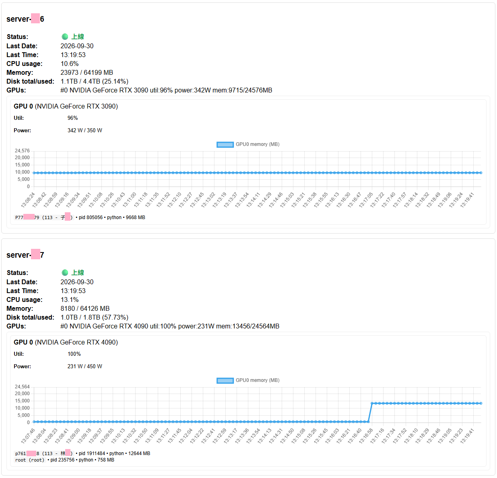

# Server Monitor

[English](README.md) | [繁體中文](README.zh-TW.md)

A lightweight real-time monitoring dashboard for Linux and NVIDIA GPU servers, designed for AI, data science, and research lab environments.

Server Monitor connects to multiple remote servers via SSH and provides a centralized web dashboard for monitoring CPU, memory, disk usage, GPU utilization, GPU memory, power consumption, and active GPU users and processes.


## Preview



## Features

- Centralized monitoring for multiple Linux / GPU servers
- Real-time CPU, memory, and disk status
- NVIDIA GPU utilization, memory usage, and power consumption
- GPU process, PID, and user information
- Supports both SSH key and password authentication
- Real-time updates via WebSocket with HTTP polling fallback
- Fast deployment with Docker Compose
- Optional Nginx, Basic Auth, and UFW setup for safer remote deployment

---

## Quick Start

**Docker Compose** is recommended for most users. If you want to modify or develop the Python application directly, you can use a **venv** instead.

### Option A - Docker Compose (Recommended)

#### 1. Create the configuration file

```bash
cp servers.example.json servers.json
```

Edit `servers.json` and add the servers you want to monitor. For example, using password authentication:

```json
[
  {
    "name": "GPU-Server-01",
    "host": "192.168.1.101",
    "port": 22,
    "username": "student",
    "password": "your_password"
  }
]
```

> For production environments, SSH key authentication is recommended. Do not commit `servers.json` to Git.

#### 2. Start the service

```bash
docker compose up -d --build
```

#### 3. Open the dashboard

On the machine running Docker, open:

```text
http://127.0.0.1:5000
```

By default, `docker-compose.yml` binds the service only to `127.0.0.1:5000`, so it is not directly exposed to external networks.

If you need to access the dashboard from another computer, use one of the following:

- SSH Tunnel
- Nginx Reverse Proxy

For public or long-term remote deployment, see [Production Deployment](#production-deployment-optional).

---

### Option B - Python venv

Suitable for local development, testing, or modifying the application.

#### Linux / macOS

```bash
python3 -m venv .venv
source .venv/bin/activate
pip install -r requirements.txt

cp servers.example.json servers.json
python app.py
```

#### Windows PowerShell

```powershell
python -m venv .venv
.venv\Scripts\Activate.ps1
pip install -r requirements.txt

Copy-Item servers.example.json servers.json
python app.py
```

After starting the application, open:

```text
http://127.0.0.1:5000
```

---

## Server Configuration

All monitored servers are configured in `servers.json`.

### Password Authentication

```json
[
  {
    "name": "GPU-Server-01",
    "host": "192.168.1.101",
    "port": 22,
    "username": "student",
    "password": "your_password"
  }
]
```

### SSH Key Authentication (Recommended)

First, generate an SSH key in the project root:

```bash
ssh-keygen -t ed25519 -f ./monitor_key -N ""
chmod 600 monitor_key
```

Copy the public key to the server you want to monitor:

```bash
ssh-copy-id -i ./monitor_key.pub -p 22 student@192.168.1.101
```

#### Using Docker

In `servers.json`, `private_key` must use the **path inside the container**:

```json
[
  {
    "name": "GPU-Server-01",
    "host": "192.168.1.101",
    "port": 22,
    "username": "student",
    "private_key": "/app/monitor_key"
  }
]
```

`docker-compose.yml` mounts the private key from the project directory into the container:

```yaml
volumes:
  - ./servers.json:/app/servers.json:ro
  - ./monitor_key:/app/monitor_key:ro
```

#### Using Python venv

If you run `python app.py` directly from the project root, use the local path:

```json
[
  {
    "name": "GPU-Server-01",
    "host": "192.168.1.101",
    "port": 22,
    "username": "student",
    "private_key": "./monitor_key"
  }
]
```

> Docker and venv use different SSH key paths. Configure the path according to how the application is being run.

---

## Monitor the Docker Host

If Server Monitor itself is running inside Docker and you also want to monitor the Docker host, use:

```json
[
  {
    "name": "Host-Local",
    "host": "host.docker.internal",
    "port": 22,
    "username": "localuser",
    "private_key": "/app/monitor_key"
  }
]
```

Make sure the host has an SSH server enabled and that the configured account can log in via SSH.

---

## Requirements for Monitored Servers

Each monitored Linux server should provide:

- A working SSH server
- Basic Linux commands such as `free`, `df`, and `ps`
- For NVIDIA GPU monitoring, the NVIDIA driver must be installed and the following command must work:

```bash
nvidia-smi
```

If the server does not have an NVIDIA GPU, CPU, memory, and disk monitoring will still work normally.

---

## Project Structure

```text
server-monitor/
|-- app.py
|-- templates/
|   `-- index.html
|-- servers.example.json
|-- requirements.txt
|-- Dockerfile
|-- docker-compose.yml
|-- .gitignore
`-- README.md
```

Files created locally at runtime:

```text
servers.json        # Actual server configuration. Do not commit to Git.
monitor_key         # SSH private key. Do not commit to Git.
monitor_key.pub     # SSH public key.
```

---

## Common Docker Commands

Start or rebuild:

```bash
docker compose up -d --build
```

View logs:

```bash
docker compose logs -f
```

Restart after modifying `servers.json`:

```bash
docker compose restart
```

Stop the service:

```bash
docker compose down
```

---

## Remote Access with SSH Tunnel

If you only need personal remote access to the dashboard, you do not need to expose port `5000` or configure Nginx.

Run the following command on your local computer:

```bash
ssh -L 5000:127.0.0.1:5000 -p <SSH_PORT> <USER>@<SERVER_IP>
```

Then open:

```text
http://127.0.0.1:5000
```

This is often the simplest remote access method for lab or internal environments.

---

## Production Deployment (Optional)

If the dashboard needs to be shared with multiple users or accessed remotely over a longer period, it is recommended to keep Docker bound to `127.0.0.1:5000` and use Nginx as the external entry point.

### 1. Install Nginx and Basic Auth Tools

Ubuntu / Debian:

```bash
sudo apt update
sudo apt install -y nginx apache2-utils
```

### 2. Create a Basic Auth User

```bash
sudo htpasswd -c /etc/nginx/.htpasswd monitor_user
```

You will be prompted to enter the password used to access the dashboard.

### 3. Configure Nginx Reverse Proxy

Create the configuration file:

```bash
sudo nano /etc/nginx/sites-available/server-monitor
```

Add:

```nginx
server {
    listen 80;
    server_name _;

    auth_basic "Server Monitor";
    auth_basic_user_file /etc/nginx/.htpasswd;

    location / {
        proxy_pass http://127.0.0.1:5000;
        proxy_http_version 1.1;

        proxy_set_header Upgrade $http_upgrade;
        proxy_set_header Connection "upgrade";
        proxy_set_header Host $host;
        proxy_set_header X-Real-IP $remote_addr;
        proxy_set_header X-Forwarded-For $proxy_add_x_forwarded_for;

        proxy_read_timeout 86400s;
        proxy_send_timeout 86400s;
    }
}
```

Enable the configuration:

```bash
sudo ln -s /etc/nginx/sites-available/server-monitor /etc/nginx/sites-enabled/server-monitor
sudo nginx -t
sudo systemctl restart nginx
```

If you do not need the default Nginx site, remove it:

```bash
sudo rm -f /etc/nginx/sites-enabled/default
sudo systemctl restart nginx
```

You can then access the dashboard at:

```text
http://<SERVER_IP>
```

> If the service is accessible over the Internet, HTTPS/TLS is strongly recommended. Basic Auth alone does not encrypt HTTP traffic.

---

## UFW Firewall (Optional)

If you use UFW, you can allow only the ports required for SSH and Nginx.

> **Warning:** Before changing firewall rules, confirm your SSH port and keep your current SSH session open. It is recommended to test a new SSH connection in another terminal before closing the existing session.

For example, if SSH uses port `22`:

```bash
sudo ufw default deny incoming
sudo ufw default allow outgoing
sudo ufw allow 22/tcp
sudo ufw allow 80/tcp
sudo ufw enable
sudo ufw status verbose
```

If SSH uses a different port, replace `22` with the actual SSH port.

If HTTPS is configured, you will usually also need:

```bash
sudo ufw allow 443/tcp
```

Because the Docker service is bound to `127.0.0.1:5000` by default, port `5000` normally does not need to be exposed externally.

---

## Troubleshooting

### Server Shows as Offline

First, verify that the monitoring host can connect to the target server via SSH:

```bash
ssh -p <PORT> <USER>@<SERVER_IP>
```

If you are using an SSH key:

```bash
ssh -i ./monitor_key -p <PORT> <USER>@<SERVER_IP>
```

### GPU Information Is Not Displayed

Log in to the monitored server and verify that the following command works:

```bash
nvidia-smi
```

If `nvidia-smi` does not work correctly, Server Monitor cannot retrieve GPU information.

### Dashboard Is Not Available After Starting Docker

Check the service status and logs:

```bash
docker compose ps
docker compose logs -f
```

Also make sure you are opening the dashboard locally at:

```text
http://127.0.0.1:5000
```

### Other Computers Cannot Connect Directly to Port 5000

This is expected behavior. By default, Docker Compose binds the service only to:

```text
127.0.0.1:5000
```

Use an SSH Tunnel or configure an Nginx Reverse Proxy for remote access.

---

## Security Notes

Do not commit the following files to a public Git repository:

```text
servers.json
monitor_key
monitor_key.pub
.env
```

Your `.gitignore` should contain at least:

```gitignore
.venv/
__pycache__/
*.pyc

servers.json
monitor_key
monitor_key.pub
.env
```

Additional recommendations:

- Prefer SSH key authentication in production environments. Do not store server passwords in public files.
- Set private key permissions to `600`.
- Do not expose the Flask / Socket.IO service on port `5000` directly to the Internet.
- For public-facing deployments, use Nginx together with authentication and HTTPS/TLS.
- Restrict the monitoring account to the minimum permissions required to read system status information.

---

## Notes

Server Monitor periodically retrieves remote system status over SSH, so the monitoring host must be able to connect to the SSH port of each target server.

If the target servers are located behind different network segments, VPNs, firewalls, or cloud security groups, make sure the relevant network rules allow SSH connections from the monitoring host.

## License

This project is licensed under the MIT License. See the [LICENSE](LICENSE) file for details.
